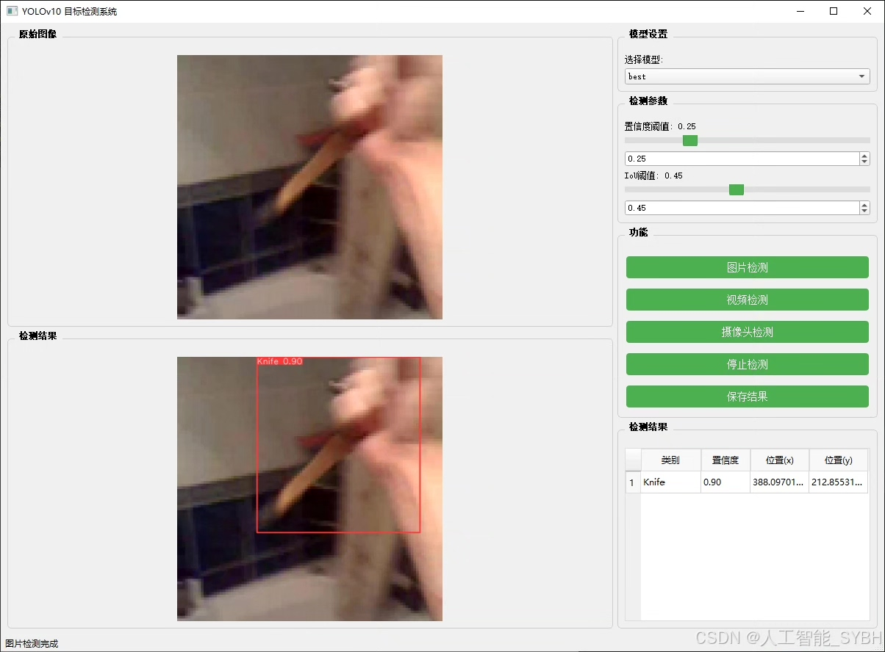
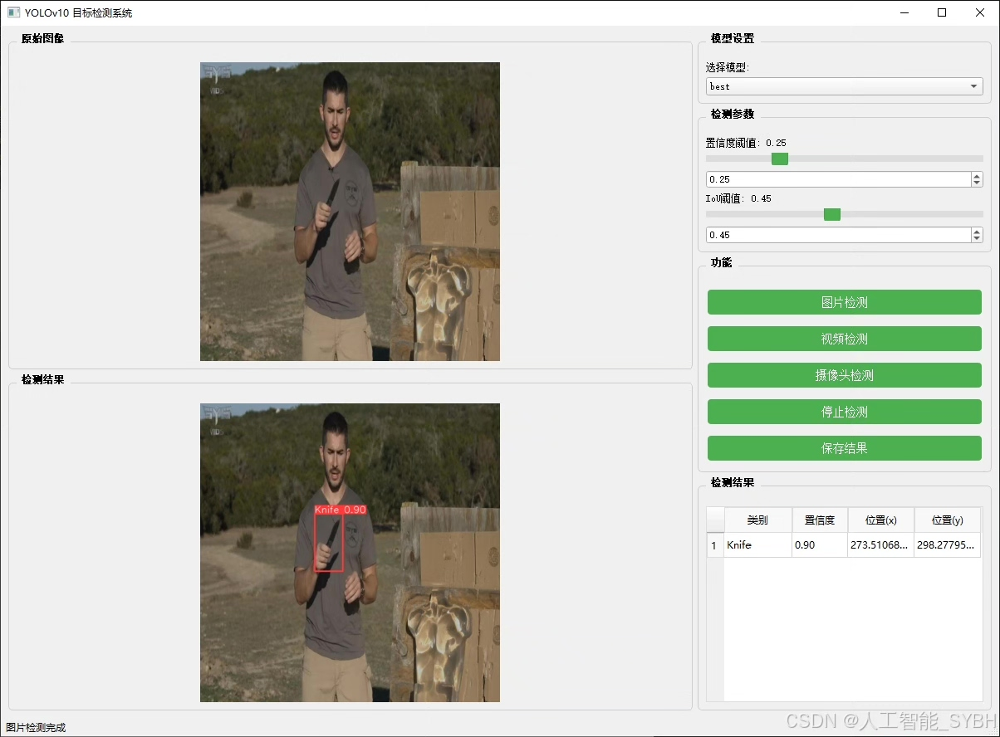
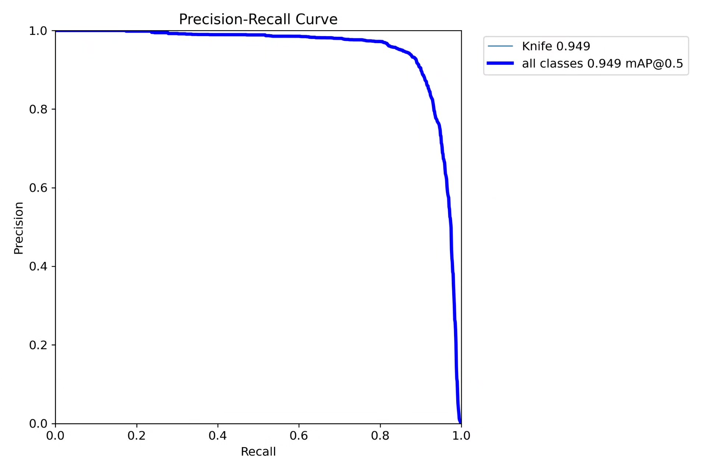
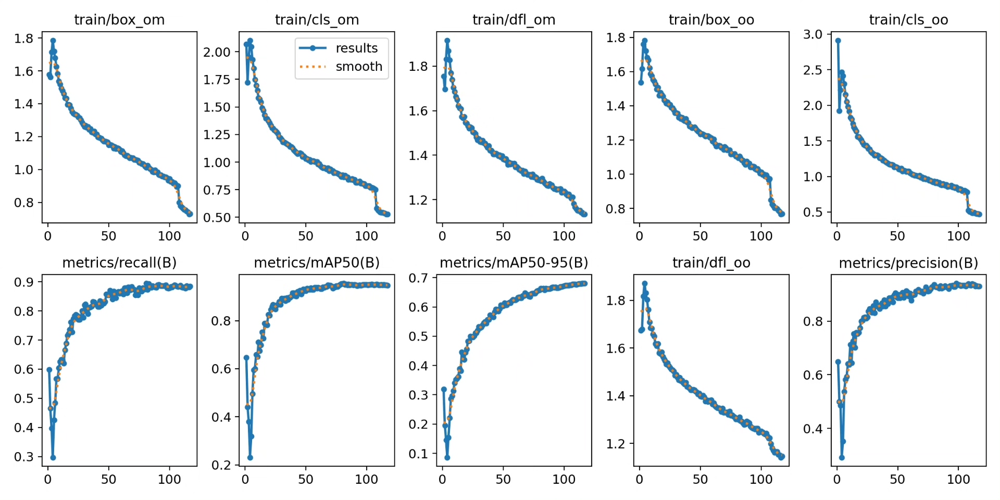
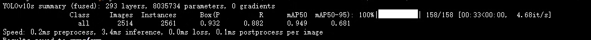
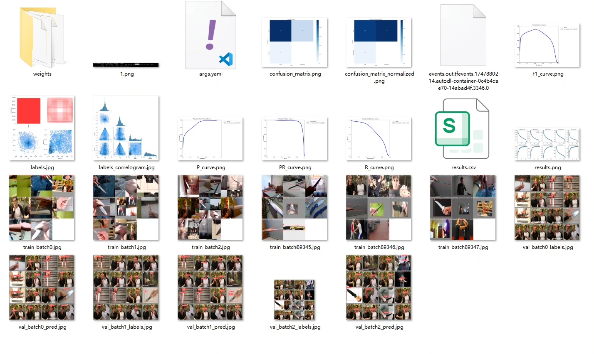
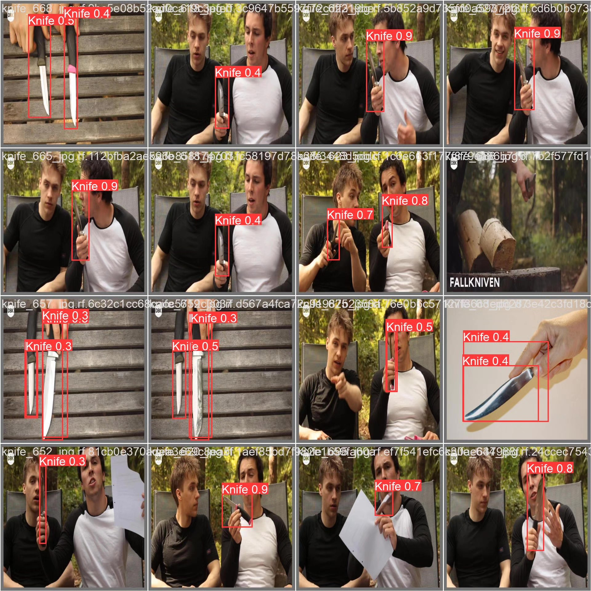

# Based on deep learning YOLOv10 for dangerous weapon identification detection system (YOLOv

## Body

This project has developed an efficient hazardous weapon recognition detection system based on the YOLOv10 object detection algorithm, specifically designed for identifying dangerous items such as knives. The system is trained and validated using a custom dataset containing 9199 images, with 6675 training images and 2514 validation images. It can accurately detect dangerous weapons like knives in real-time video streams or static images, applicable to public places security, intelligent surveillance, campus safety, and other scenarios, providing intelligent solutions for safety protection. Compared to previous YOLO algorithms, YOLOv10 significantly improves detection speed while maintaining high accuracy, making it more suitable for deployment on resource-limited edge devices.

The company's products have obtained the official commercial license certification from YOLO.

We provide after-sales service:

After payment, we will provide WeChat ID for any questions.

Environmental configuration: We will provide a tutorial on environmental configuration, and WeChat will provide answers to questions.

Remote installation service: If you need remote configuration of the environment, an additional fee of 69 is required.
If the configuration fails, all fees will be refunded (specially for old computers only refunding installation fees).

Retraining dataset: After configuring the environment, you can train on your own computer.
If you need us to retrain, just pay 69 + computing power fees (2.5 yuan/hour)

## Images

## Payment

Here is a pay link on Stripe ( https://buy.stripe.com/3cs8yP7sY87d0vu9AB ). Please contact me lonlonago@foxmail.com after funding $89, and I will send you a complete data files , thank you!

